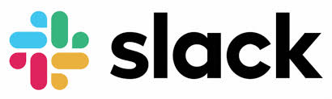

# Slack Clone

Building a clone of Slack, a collaboration hub that can replace email to help you and your team work together seamlessly. I'll be tweaking the styling a bit to make it sort of my own.

## Built With

* [React](https://reactjs.org/) - The front-end framework used
* [GraphQL](https://graphql.org/) - Query language for APIs
* [PostgreSQL](https://www.postgresql.org/) - Relational database
* [Semantic UI](https://semantic-ui.com/) - Component framework
* [MobX](https://mobx.js.org/README.html) - State management library
* [Express](https://expressjs.com/) - Web framework

## Acknowledgments

* Ben Awad (https://www.youtube.com/channel/UC-8QAzbLcRglXeN_MY9blyw) - Referenced tutorial